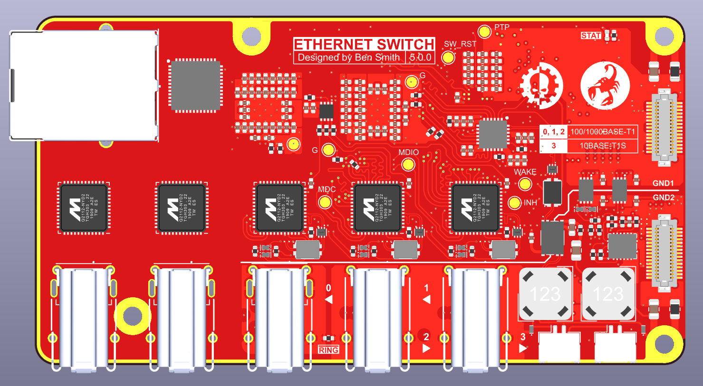

# Switch v5 Hardware (WIP)

KiCad design files for the 5th iteration of my single pair Ethernet (SPE) switch. It is similar to [v4](https://github.com/ben5049/switch-v4-hardware) but with more ports and an RJ45 connector so an external media converter isn't needed to connect to regular Ethernet networks.

